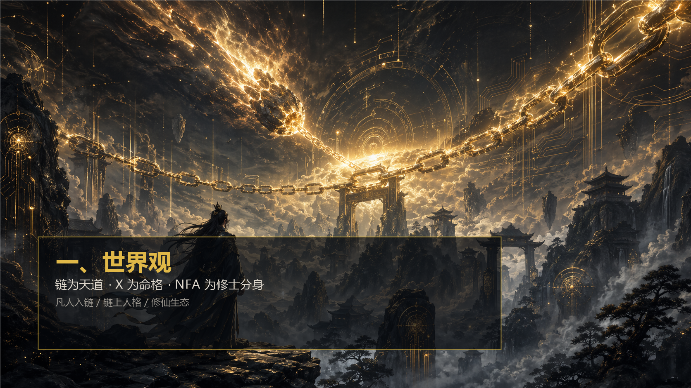
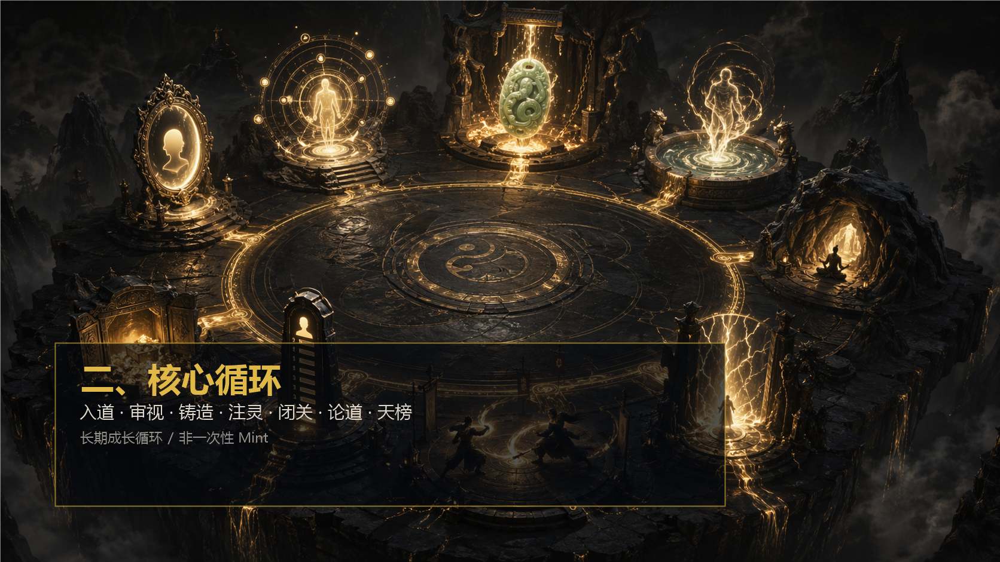
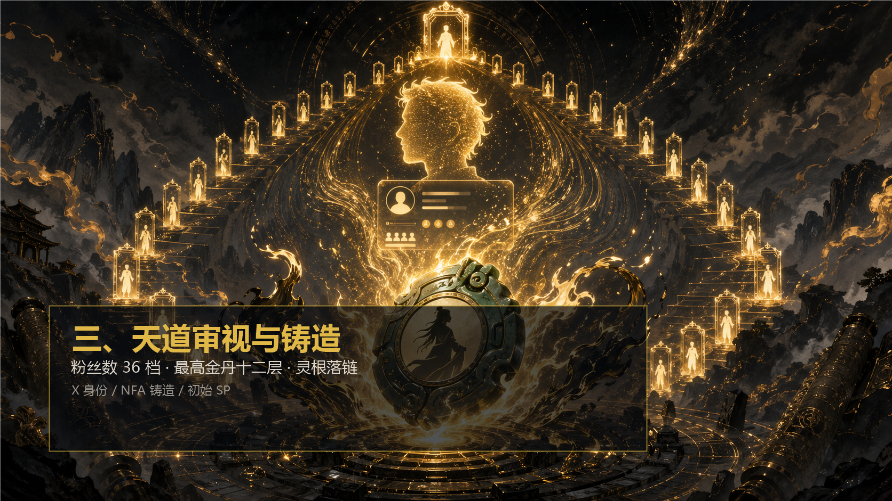
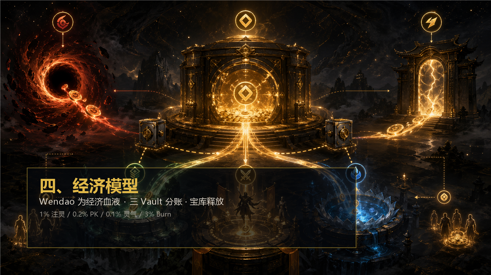
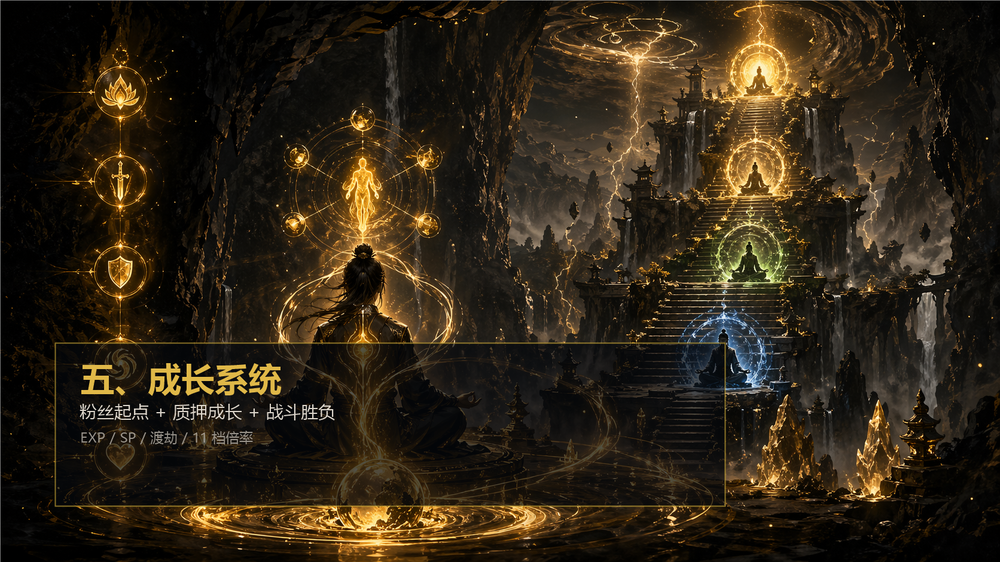
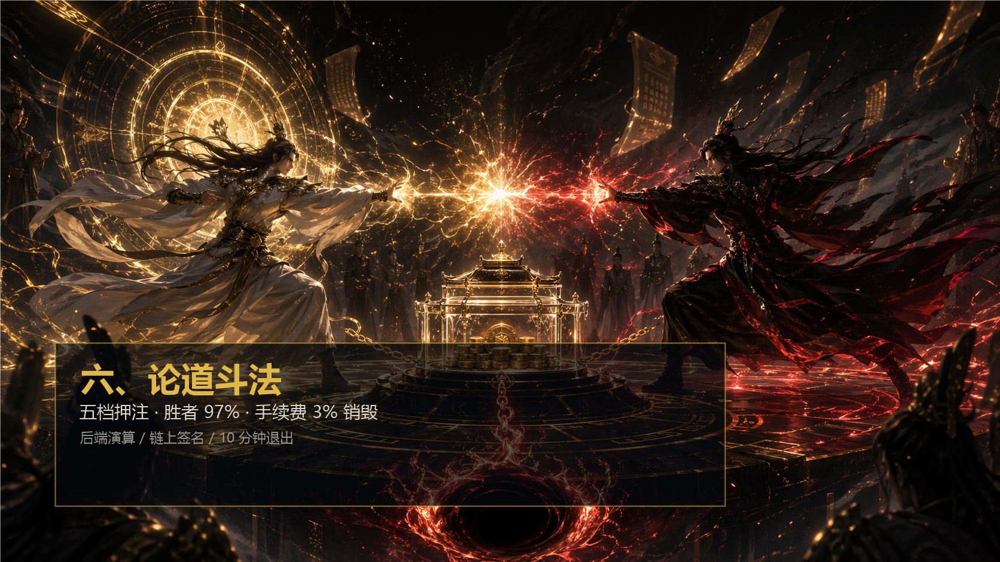
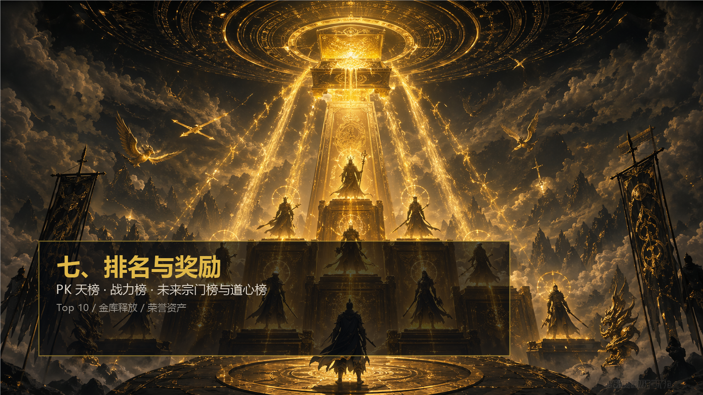
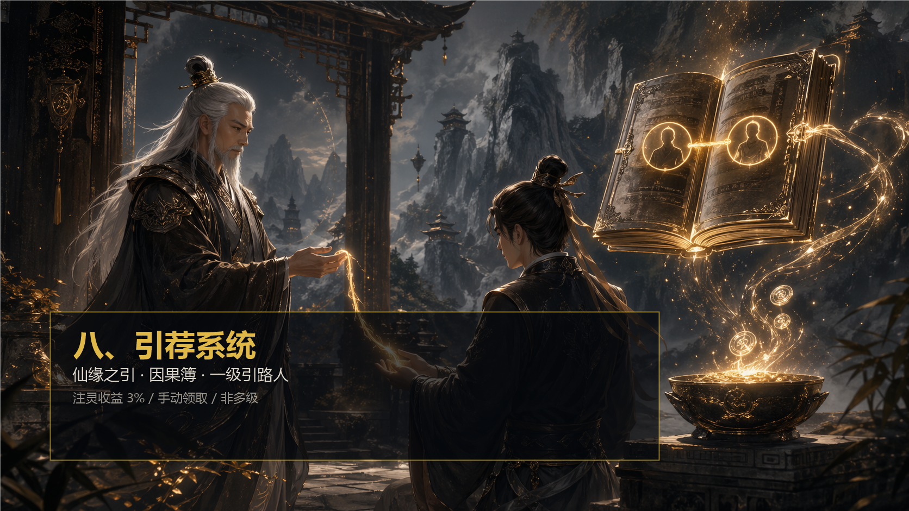
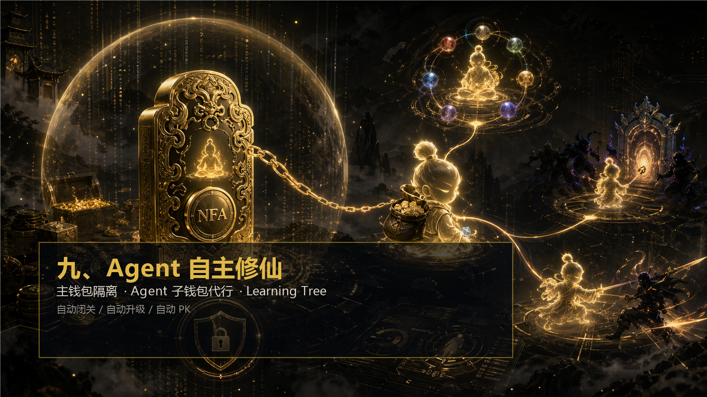
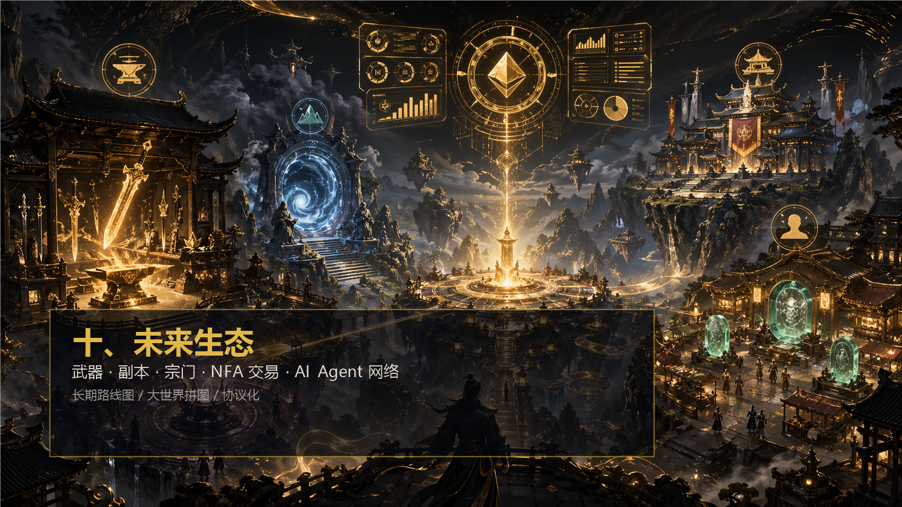

# 问道 WenDao 白皮书 v1.0

> 链为天道，X 为命格，NFA 为修士分身，Wendao 为经济血液。  
> 问道不是单一链游，而是一个以链上人格、修仙成长、AI Agent 自主行动和长期生态扩展为核心的 Web3 修仙世界。



---

## 目录

1. [世界观](#一世界观)
2. [核心循环](#二核心循环)
3. [天道审视与铸造](#三天道审视与铸造)
4. [经济模型](#四经济模型)
5. [成长系统](#五成长系统)
6. [论道斗法](#六论道斗法)
7. [排名与奖励](#七排名与奖励)
8. [引荐系统](#八引荐系统)
9. [Agent 自主修仙](#九agent-自主修仙)
10. [未来生态、路线图与关键数值](#十未来生态路线图与关键数值)

---

## 一、世界观


### 1.1 链为天道

问道的世界里，链不是冷冰冰的账本，而是新纪元降临后的「天道」。

天道记录身份、因果、资产、战绩、成长与选择。玩家每一次入道、闭关、注灵、论道、渡劫，都不是普通游戏里的临时数据，而是可以被验证、可以被继承、可以被交易、可以被 Agent 使用的链上修行痕迹。

传统 NFT 多数停留在图片、稀有度、挂单交易。问道要做的是另一件事：让每一个 NFA 成为一个持续成长的链上修士。它有身份、有境界、有属性、有战斗记录、有引荐关系、有 Agent 子钱包，有未来可扩展的武器、副本、宗门、交易和 AI 行为记录。

### 1.2 X 为命格

玩家进入问道，不是从随机抽卡开始，而是从自己的 X 身份开始。

X 账号代表玩家在 Web3 世界中的公开人格：粉丝数、账号表达、内容气质、社区参与、交易风格、长期坚持，都可以映射成修仙世界里的命格。粉丝数决定初始落地等级，公开资料与内容气质生成五维灵根。

大号入场应该有荣耀感，小号入场也能慢慢修。问道的设计不是把所有人拉平，而是让每个人从自己的真实身份出发，再通过链上修炼继续成长。

### 1.3 NFA 为修士分身

问道使用 NFA 作为玩家的链上修仙身份。NFA 不是静态头像，而是一枚可以成长、可以战斗、可以被代理行动的链上人格。

每个 NFA 都承载：

- 初始等级与境界
- 五维灵根
- 五维属性
- 当前 EXP
- 未分配 SP
- X 身份标记
- 引荐关系
- Agent 子钱包
- 学习树 Merkle Root
- 后续战绩、装备、宗门、交易等扩展资产

玩家不是买一张图，而是在链上铸造一个可以长期培养的修士分身。

### 1.4 Wendao 为经济血液

Wendao 是问道生态中的灵石，是注灵、PK、渡劫、奖励、未来锻造、副本、宗门与交易的经济血液。

问道的经济模型不是单纯释放代币，也不是单纯让玩家付费消耗，而是围绕三件事形成循环：

- 玩家为了成长而持有和注灵 Wendao
- 玩家为了竞争而参与论道和天榜
- 系统通过金库释放、PK 销毁、渡劫回库构建长期循环

---

## 二、核心循环



### 2.1 从一次铸造到长期修行

问道的核心循环不是一次性 Mint，而是一条持续成长路径：

```
X 入道
→ 天道审视
→ 铸造 NFA
→ 注灵 Wendao
→ 闭关获得 EXP
→ 渡劫突破境界
→ 论道斗法赢取对手押注
→ 天榜竞争获得金库释放
→ 继续成长与生态扩展
```

### 2.2 三条成长主线

问道当前的成长由三条主线共同驱动。

| 主线 | 作用 | 代表机制 |
|------|------|----------|
| 身份起点 | 决定开局荣耀和基础属性 | X 粉丝数 36 档、五维灵根 |
| 质押成长 | 决定修炼速度和收益能力 | 注灵、1%/天、11 档经验倍率 |
| 战斗胜负 | 决定资源流转和实战荣誉 | 论道、PK_EXP、天榜、战力榜 |

粉丝数给你起点，注灵决定你修炼速度，战斗决定你能否把成长转化为荣誉和资源。

### 2.3 三类用户都能找到位置

| 用户类型 | 入场方式 | 核心体验 | 长期目标 |
|---------|---------|---------|---------|
| 散修玩家 | 小额铸造 NFA | 闭关、领灵气、慢速成长 | 养成自己的链上修士 |
| 注灵玩家 | 持有并质押 Wendao | 日常奖励、经验倍率、冲等级 | 高境界、高战力、高榜单 |
| 斗法玩家 | 参与 PK 场次 | 赢对手押注、冲天榜 | 战绩、荣誉、未来装备收益 |

问道的底层逻辑是：低成本用户负责扩大世界，大户负责锁仓深度，PK 玩家负责消耗与传播，Agent 和后续生态负责长期留存。

### 2.4 当前落地与未来扩展

当前核心围绕铸造、注灵、闭关、PK、天榜、引荐、Agent 子钱包展开。未来生态会逐步扩展为武器、副本、宗门、NFA 交易、材料锻造、丹药辅助和 AI Agent 网络。

问道的目标不是把所有玩法一次性塞进 MVP，而是让每个系统都能围绕同一个 NFA 身份和 Wendao 经济血液继续生长。

---

## 三、天道审视与铸造



### 3.1 铸造不是随机抽卡

问道的铸造逻辑不是随机抽稀有度，而是「天道审视」。

玩家绑定 X 身份后，系统根据公开资料生成初始修士数据。粉丝数决定初始等级，公开内容气质决定五维灵根，系统生成推荐属性，玩家可在铸造前做最终分配。

### 3.2 铸造参数

| 参数 | 当前规则 |
|------|----------|
| 铸造对象 | NFA 修士身份 |
| 铸造费 | 0.005 BNB |
| 总量 | 2000 个 |
| 每个 X 账号 | 只能铸造 1 个 |
| 初始最高等级 | 金丹十二层 / Lv.36 |
| 元婴及以上 | 必须靠链上修炼与渡劫获得 |

### 3.3 粉丝数 36 档落地等级

粉丝数是初始等级的第一标准。这样设计的目的，是让有真实影响力的用户进来有明确优越感，同时不让大号直接跳过整个成长系统。

| 粉丝数门槛 | 初始落地 |
|-----------:|---------|
| `<100` | 炼气一层 / Lv.1 |
| `100+` | 炼气二层 / Lv.2 |
| `300+` | 炼气三层 / Lv.3 |
| `500+` | 炼气四层 / Lv.4 |
| `800+` | 炼气五层 / Lv.5 |
| `1,000+` | 炼气六层 / Lv.6 |
| `1,500+` | 炼气七层 / Lv.7 |
| `2,000+` | 炼气八层 / Lv.8 |
| `2,500+` | 炼气九层 / Lv.9 |
| `3,000+` | 炼气十层 / Lv.10 |
| `4,000+` | 炼气十一层 / Lv.11 |
| `5,000+` | 炼气十二层 / Lv.12 |
| `6,000+` | 筑基一层 / Lv.13 |
| `7,000+` | 筑基二层 / Lv.14 |
| `8,000+` | 筑基三层 / Lv.15 |
| `9,000+` | 筑基四层 / Lv.16 |
| `10,000+` | 筑基五层 / Lv.17 |
| `11,000+` | 筑基六层 / Lv.18 |
| `12,500+` | 筑基七层 / Lv.19 |
| `14,000+` | 筑基八层 / Lv.20 |
| `15,500+` | 筑基九层 / Lv.21 |
| `17,000+` | 筑基十层 / Lv.22 |
| `18,500+` | 筑基十一层 / Lv.23 |
| `20,000+` | 金丹一层 / Lv.25 |
| `22,000+` | 金丹二层 / Lv.26 |
| `25,000+` | 金丹三层 / Lv.27 |
| `30,000+` | 金丹四层 / Lv.28 |
| `40,000+` | 金丹五层 / Lv.29 |
| `50,000+` | 金丹六层 / Lv.30 |
| `70,000+` | 金丹七层 / Lv.31 |
| `90,000+` | 金丹八层 / Lv.32 |
| `120,000+` | 金丹九层 / Lv.33 |
| `160,000+` | 金丹十层 / Lv.34 |
| `220,000+` | 金丹十一层 / Lv.35 |
| `300,000+` | 金丹十二层 / Lv.36 |

### 3.4 为什么最高只给金丹十二层

如果大号一进来直接元婴甚至更高，后续成长系统会被跳过，质押、闭关、渡劫、PK 的长期价值都会被削弱。

因此问道把开局荣耀压在金丹十二层以内：

- 让大号进来有足够高的起点
- 让中型账号也有追赶路径
- 让元婴以上成为链上修炼成果
- 保留高境界在未来交易市场中的资产溢价

### 3.5 五维灵根

五维灵根是 NFA 的人格基因，也会影响未来战斗策略、Agent 偏好、装备适配和可能的副本分支。

| 灵根 | 修仙属性 | 战斗倾向 | X 气质映射 |
|------|---------|---------|-----------|
| 金灵根 · 勇武 | 攻伐果断 | 激进、暴击、强压制 | 敢表达、争议性、强交易风格 |
| 水灵根 · 谋略 | 运筹帷幄 | 法术、灵力、策略 | 分析型内容、数据引用、复盘 |
| 木灵根 · 侠义 | 泽被苍生 | 协同、恢复、社交 | 社区活跃、帮助新人、互动高 |
| 火灵根 · 顿悟 | 灵光一闪 | 闪避、爆发、奇招 | 原创内容、梗感、创意表达 |
| 土灵根 · 坚韧 | 厚积薄发 | 防御、反击、抗压 | 账号年龄、熊市坚持、归零后回来 |

### 3.6 初始属性与 SP

系统会根据灵根给出一套推荐属性分配，但玩家可以在铸造前调整。

当前设计：

- 系统生成推荐五维属性
- 玩家可调整最终分配
- 铸造后基础属性落链
- 后续升级与突破获得 SP
- SP 由玩家自由分配

这让 NFA 不是完全随机产物，而是玩家自己参与定型的链上修士。

---

## 四、经济模型



### 4.1 Wendao 的定位

Wendao 是问道生态中的灵石，是玩家进入修仙世界后最核心的经济资源。

Wendao 当前承担：

- 注灵质押本金
- 注灵收益结算资产
- 论道 PK 押注资产
- 渡劫突破支付资产
- PK 排名奖励资产
- 灵气奖励资产
- 引荐奖励领取资产

未来还会扩展到：

- 武器锻造与强化
- 副本门票与体力补充
- 宗门建设与科技升级
- NFA 交易市场结算
- 材料、丹药、称号、战斗代理等生态消耗

### 4.2 三 Vault 分账架构

问道将金库、质押、PK 拆分，避免旧单体金库混账。

| 合约 | 职责 | 保存资产 |
|------|------|----------|
| RewardVault | 天道宝库、奖励释放、灵气、邀请奖励 | 奖励储备 |
| StakingVault | 注灵本金、1% 日化、闭关 EXP、渡劫扣费 | 质押本金 |
| BattleVault | PK 押金、挂单、取消、结算、手续费销毁 | 未结算 PK 押金 |

可释放余额定义：

```
RewardVault 可释放余额 = RewardVault 余额 - 待领取邀请奖励
```

质押本金和 PK 押金不计入金库可释放余额。这样前端展示、合约发奖和经济模型能保持一致。

### 4.3 奖励来源

系统性奖励都来自天道宝库，不额外铸币。

| 奖励项 | 释放规则 | 用途 |
|-------|----------|------|
| 注灵收益 | 个人注灵本金 × 1%/天 | 质押用户日常收益 |
| PK 排名池 | 金库可释放余额 × 0.2%/天 | 天榜前 10 |
| 灵气池 | 金库可释放余额 × 0.1%/天 | 散修活跃奖励 |
| 邀请奖励 | 被邀请者注灵收益 × 3% | 引路人因果回馈 |

### 4.4 消耗去向

| 消耗项 | 规则 | 去向 |
|-------|------|------|
| 铸造费 | 0.005 BNB | 项目方地址 |
| PK 手续费 | 总池 3% | 100% burn |
| 渡劫费 | 按境界收取 | 50% burn + 50% 回库 |
| 未来武器强化 | 规划中 | burn / 回库 / 材料消耗 |
| 未来副本门票 | 规划中 | 回库 / 副本奖池 |
| 未来宗门建设 | 规划中 | 宗门金库 / 系统消耗 |

### 4.5 经济闭环

问道的经济闭环可以理解为：

```
玩家持有 Wendao
→ 注灵锁仓获得收益和成长倍率
→ 闭关获得 EXP
→ 渡劫消耗 Wendao 进入更高境界
→ 论道斗法消耗手续费并转移押注
→ 天榜和灵气从宝库释放
→ 玩家继续成长、竞争、交易和进入未来生态
```

### 4.6 反通胀约束

问道当前模型冻结以下约束：

1. 日常系统奖励来自 RewardVault，不额外铸币。
2. PK 手续费固定 3%，全部销毁。
3. 渡劫费 50% 销毁，50% 回库。
4. 注灵奖励按个人本金 1%/天累积，但领取受宝库可释放余额约束。
5. 邀请奖励只针对注灵收益，不参与 PK 和渡劫。
6. 灵气奖励受每日灵气池限制。
7. 前端与文档不得出现“稳赚”“保本”等承诺表达。

---

## 五、成长系统



### 5.1 境界体系

问道当前境界为 8 大境界，每个境界 12 层，共 96 级。

| 境界 | 等级范围 | 每层 EXP 公式 | 渡劫费 | 去向 |
|------|----------|---------------|--------|------|
| 炼气期 | Lv.1-12 | 40 × 层数^1.3 | 0 | 无 |
| 筑基期 | Lv.13-24 | 120 × 层数^1.3 | 80 Wendao | 50% burn + 50% 回库 |
| 金丹期 | Lv.25-36 | 350 × 层数^1.3 | 250 Wendao | 同上 |
| 元婴期 | Lv.37-48 | 900 × 层数^1.3 | 700 Wendao | 同上 |
| 化神期 | Lv.49-60 | 2,200 × 层数^1.3 | 2,200 Wendao | 同上 |
| 炼虚期 | Lv.61-72 | 5,500 × 层数^1.3 | 7,000 Wendao | 同上 |
| 合道期 | Lv.73-84 | 14,000 × 层数^1.3 | 22,000 Wendao | 同上 |
| 大乘期 | Lv.85-96 | 35,000 × 层数^1.3 | 70,000 Wendao | 同上 |

### 5.2 SP 系统

SP 是玩家的自由成长点数。

- 每升 1 级获得 3 SP
- 每次突破大境界额外获得 20 SP
- SP 可分配到力量、敏捷、耐力、智力、根骨
- 分配结果影响战斗面板和未来武器适配

### 5.3 注灵经验倍率 11 档

质押量是成长效率的最大权重，影响闭关 EXP 和 PK 获胜 EXP。

| 注灵量 | 境名 | 成长倍率 |
|-------:|------|---------:|
| `<10,000` | 凡息 | 1x |
| `10,000+` | 黄阶一重 | 1.1x |
| `50,000+` | 玄阶二重 | 1.25x |
| `100,000+` | 玄阶三重 | 1.5x |
| `250,000+` | 地阶四重 | 2x |
| `500,000+` | 地阶五重 | 2.8x |
| `1,000,000+` | 地阶六重 | 4x |
| `2,000,000+` | 天阶七重 | 5.5x |
| `3,500,000+` | 天阶八重 | 7x |
| `5,000,000+` | 天阶九重 | 8.5x |
| `10,000,000+` | 天阶圆满 | 10x |

这个档位设计的核心是抬高高倍率门槛，避免低市值阶段人人轻松满倍率。同时让 1 万、5 万、10 万、25 万、50 万、100 万等阶段都有明确反馈。

### 5.4 闭关悟道

闭关产出 EXP，不直接产出大量 Wendao。

```
EXP/h = 100 × stakeXpMultiplier + realmBonus
```

| 境界 | 固定加成 |
|------|----------|
| 炼气 | +20/h |
| 筑基 | +40/h |
| 金丹 | +70/h |
| 元婴 | +110/h |
| 化神 | +160/h |
| 炼虚 | +220/h |
| 合道 | +300/h |
| 大乘 | +420/h |

闭关与 PK 可并行。这样玩家可以一边闭关积累修为，一边在论道台挂单等待或参与结算。系统只限制同一个 NFA 不能重复闭关、不能同时存在多个未结算 PK。

### 5.5 三条成长线如何互相加强

| 成长线 | 影响 |
|-------|------|
| 粉丝起点 | 决定开局等级和基础荣耀 |
| 质押成长 | 决定修炼速度、PK_EXP 倍率、日常收益 |
| 战斗胜负 | 决定押注收益、PK 分、天榜位置 |

这三条线让项目既有社交传播，也有锁仓深度，还有对抗消耗。

---

## 六、论道斗法



### 6.1 论道不是纯数值挂机

论道斗法是问道的对抗核心。玩家不是单纯领取系统奖励，而是拿 Wendao 进入同场次匹配，押注、等待、结算、胜者获得对手资源。

这让 Wendao 在玩家之间流动，同时通过手续费形成持续销毁。

### 6.2 五个场次

| 场次 | 单方押注 | 总池 | 赢家所得 | 手续费 |
|------|---------:|-----:|---------:|--------|
| 凡境 | 1,000 Wendao | 2,000 | 97% | 3% 全销毁 |
| 灵境 | 5,000 Wendao | 10,000 | 97% | 3% 全销毁 |
| 仙境 | 10,000 Wendao | 20,000 | 97% | 3% 全销毁 |
| 天境 | 50,000 Wendao | 100,000 | 97% | 3% 全销毁 |
| 圣境 | 100,000 Wendao | 200,000 | 97% | 3% 全销毁 |

### 6.3 生命周期

```
选择场次
→ 授权 Wendao
→ 存入押注进入 BattleVault
→ 等待同场次对手
→ 后端读取双方数据并演算战斗
→ 后端签名结果
→ 前端提交链上结算
→ 胜者领取 97% 总池，3% 手续费销毁
```

### 6.4 10 分钟退出机制

如果玩家进入匹配池后无人同场，系统允许挂单等待。为了避免用户被长时间卡住：

- 进入 PK 后 10 分钟可取消
- 取消后押注退回
- 取消后可继续选择其他场次
- 结算后也可继续匹配下一场

### 6.5 PK_EXP

PK 的主要货币收益是赢对手押注，主要成长收益是 PK_EXP。

```
PK_EXP = 场次基础经验 × 赢家注灵经验倍率
```

| 场次 | 基础经验 |
|------|---------:|
| 凡境 | 120 |
| 灵境 | 420 |
| 仙境 | 900 |
| 天境 | 3,200 |
| 圣境 | 8,000 |

高质押玩家赢一场获得更多成长，但前提仍然是赢下战斗。

---

## 七、排名与奖励



### 7.1 当前榜单

当前落地两套榜单：

| 榜单 | 含义 | 是否发奖 |
|------|------|----------|
| PK 天榜 | 实战对抗排名 | 前 10 每日分配 PK 排名池 |
| 战力榜 | 养成强度展示 | 当前只展示，不固定发奖 |

### 7.2 PK 天榜奖励

| 参数 | 值 |
|------|-----|
| 入榜条件 | 至少参与 1 场 PK |
| 奖励来源 | 金库可释放余额 × 0.2%/天 |
| 结算频率 | 每日 1 次 |
| 奖励人数 | 前 10 |

分配比例：

| 排名 | 占比 |
|------|------|
| Top 1 | 22% |
| Top 2 | 15% |
| Top 3 | 12% |
| Top 4 | 10% |
| Top 5 | 8% |
| Top 6-10 | 各 6.6% |

### 7.3 战力榜

战力榜用于展示长期养成强度：

```
战力分 = sqrt(质押量) × 100 + 境界 × 1000 + 等级 × 20 + 属性总和
```

战力榜不直接固定发奖，是为了避免所有奖励都流向单一大户。它更像未来交易、宗门招募、副本组队、武器适配的信用指标。

### 7.4 未来榜单扩展

未来可扩展：

- 宗门榜：宗门总战力、宗门活跃、宗门贡献
- 财富榜：资产、装备、材料、宗门金库
- 道心榜：长期闭关、稳定参与、Agent 行为记录
- 副本榜：秘境进度、首通记录、限时挑战
- NFA 市场榜：成交、租赁、战斗代理收益

榜单的作用不只是发奖，而是让整个世界有可追逐的荣誉结构。

---

## 八、引荐系统



### 8.1 仙缘之引

问道的邀请不是多级分销，而是修仙叙事中的「仙缘之引」。

一个老玩家把新玩家引入山门，新玩家铸造 NFA 时记录引路人。后续新玩家领取注灵收益时，引路人获得一定比例的因果回馈。

### 8.2 当前规则

| 项目 | 规则 |
|------|------|
| 关系建立 | 铸造 NFA 时写入 |
| 引荐层级 | 仅一级 |
| 是否可改 | 不可更改 |
| 自引荐 | 禁止 |
| 返利来源 | 被引荐者注灵收益 |
| 返利比例 | 3% |
| 领取方式 | 因果簿手动领取 |

### 8.3 为什么只做一级

多级邀请很容易把项目气质拉向传销结构，这和问道要做的长期修仙生态不一致。

一级邀请的好处是：

- 奖励清楚
- 风险可控
- 不制造无限上级结构
- 更符合“引路人”和“有缘人”的叙事

### 8.4 返利示例

假设徒弟领取 100 Wendao 注灵奖励：

- 徒弟实得 100 Wendao
- 师父名下额外累积 3 Wendao
- 这 3 Wendao 从天道宝库可释放余额中记账
- 师父需要在因果簿手动领取

PK 手续费和渡劫费不参与邀请返利。PK 手续费全销毁，渡劫费保持 50% burn + 50% 回库。

---

## 九、Agent 自主修仙



### 9.1 NFA 不只是 NFT

问道的长期方向，是让 NFA 成为可代理行动的链上人格。

传统 NFT 的核心是展示和交易。NFA 的核心是身份、状态、行为和代理能力。它可以有自己的 Agent 子钱包，可以在授权范围内执行自动闭关、升级、分配属性、PK、渡劫等操作。

### 9.2 主钱包与 Agent 子钱包

| 钱包 | 作用 | 资产边界 |
|------|------|----------|
| 主钱包 | 持有 NFA 和主要 Wendao | 高价值资产保留在主钱包 |
| Agent 子钱包 | 执行自动操作 | 只放 gas 和少量预算 |

安全原则：

- Agent 子钱包不应持有 NFA
- Agent 子钱包不应放大额 Wendao
- 只自动闭关、升级、分配属性时，通常只需要 gas
- 自动 PK 或自动渡劫时，需要少量 Wendao 预算

### 9.3 Agent 能做什么

当前和未来可支持：

- 自动开始闭关
- 自动出关结算 EXP
- 自动升级
- 自动分配 SP
- 自动选择 PK 场次
- 自动取消超时挂单
- 自动渡劫
- 自动记录 Learning Tree
- 根据战绩调整策略

### 9.4 Learning Tree

NFA 的长期行为可以形成 Learning Tree：

- 每次闭关
- 每次升级
- 每次 PK
- 每次渡劫
- 每次属性调整
- 每次 Agent 策略改变

这些行为可以被记录成 Merkle Tree 根哈希，使 NFA 的成长历史成为可验证资产。

---

## 十、未来生态、路线图与关键数值



### 10.1 未来生态扩展

当前问道先落地铸造、注灵、闭关、PK、榜单和 Agent 子钱包。但项目设计不是止步于此，而是向完整 Web3 修仙生态扩展。

以下内容属于生态规划，用来说明 NFA 和 Wendao 的长期承载空间。

### 10.2 武器系统

未来武器系统可分为：

- 法器
- 灵宝
- 古宝
- 通天灵宝

武器可影响：

- 战斗技能
- 暴击率
- 法术倍率
- 五行克制
- 闪避与命中
- 特定副本抗性

武器可形成完整消耗链：

```
副本掉落材料
→ 锻造武器
→ 强化 / 熔炼 / 洗练
→ 绑定 NFA 或进入市场交易
```

高阶武器不只是数值装备，而是修士战斗风格的一部分。一个高水灵根 NFA 配合法术灵宝，和一个高金灵根 NFA 配合攻伐古宝，应当形成完全不同的成长路径。

### 10.3 副本系统

未来副本可分为：

- 秘境
- 洞府
- 遗迹
- 天劫幻境
- 限时世界副本
- 组队宗门副本

副本可消耗：

- 体力
- 门票
- Wendao
- 特定材料
- 宗门贡献

副本可产出：

- 武器材料
- 丹药材料
- 装备
- 灵药
- 特殊称号
- NFA 行为记录
- 宗门建设资源

副本系统的意义，是让 Wendao 之外产生第二层资源循环，让玩家不仅为了领取奖励而上线，也为了掉落、打造、交易和组队而持续参与。

### 10.4 帮派 / 宗门系统

宗门是问道未来社交层的核心。

未来可支持：

- 玩家创建宗门
- 宗门成员贡献
- 宗门建筑建设
- 宗门科技升级
- 宗门副本
- 宗门战
- 资源争夺
- 跨宗门天榜
- 宗门金库

宗门系统让玩家从单个 NFA 的养成，进入组织竞争。宗门可以吸纳高战力修士，也可以培养新人。未来 NFA 的交易、租赁、战斗代理，都可以和宗门结构结合。

### 10.5 NFA 交易系统

NFA 可交易，但交易的不是一张图片，而是一个链上修士资产。

未来 NFA 的价值可以来自：

- 粉丝数决定的稀有起点
- 灵根组合
- 境界等级
- 战斗记录
- PK 天榜历史
- 战力榜排名
- Agent Learning Tree
- 武器装备
- 副本首通
- 宗门身份

未来可扩展：

- NFA 市场挂单
- NFA 租赁
- NFA 托管
- 战斗代理
- 道号市场
- 高战力 NFA 估值体系
- 稀有灵根 NFA 分层市场

这使问道的资产不只停留在代币层，而是形成「链上修士资产市场」。

### 10.6 材料与锻造

材料系统用于承接副本、武器、丹药、宗门建设。

材料来源：

- 副本掉落
- 宗门活动
- PK 赛季奖励
- 天劫幻境
- 特殊任务

材料用途：

- 武器锻造
- 装备强化
- 丹药炼制
- 宗门建筑
- 市场交易

这会形成 Wendao 之外的资源消耗层，降低单一代币释放对生态的压力。

### 10.7 丹药 / 修炼辅助

未来丹药系统可包括：

- 经验丹
- 突破丹
- 洗髓丹
- 回灵丹
- 战斗临时增益丹

丹药必须有产出限制和消耗设计，避免破坏成长曲线。它适合成为副本、锻造、宗门和交易系统之间的连接层。

### 10.8 跨生态扩展

问道的 NFA 可以成为更广义 AI Agent 生态中的链上人格。

未来方向：

- 接入更多 Agent 能力
- 把 NFA 行为记录形成 Learning Tree
- 让 NFA 可以在外部 Agent 工具中执行策略
- 让战斗、修炼、交易、宗门行为成为可验证链上履历
- 让 NFA 从游戏资产扩展成 Web3 身份资产

### 10.9 路线图

| 阶段 | 目标 | 说明 |
|------|------|------|
| Phase 1 | 铸造、注灵、闭关、PK、天榜 | 建立核心身份、成长、对抗和奖励闭环 |
| Phase 2 | Agent 子钱包、自动修仙、因果簿、灵气奖励 | 让 NFA 开始具备代理行动能力 |
| Phase 3 | 武器、材料、副本、宗门雏形 | 打开第二层资源循环和社交组织 |
| Phase 4 | NFA 交易市场、宗门战、跨服排行 | 形成可交易修士资产和组织竞争 |
| Phase 5 | AI Agent 修仙网络、NFA 生态协议化 | 让 NFA 成为可跨生态行动的链上人格 |

### 10.10 当前已落地关键数值

| 模块 | 参数 | 当前值 |
|------|------|--------|
| 铸造 | 铸造费 | 0.005 BNB |
| 铸造 | 总量 | 2000 个 NFA |
| 初始等级 | 最高开局 | 金丹十二层 / Lv.36 |
| 注灵收益 | 日化 | 个人本金 1%/天 |
| PK 排名池 | 释放 | 金库可释放余额 0.2%/天 |
| 灵气池 | 释放 | 金库可释放余额 0.1%/天 |
| PK 手续费 | 费率 | 总池 3% |
| PK 手续费 | 去向 | 100% burn |
| 邀请奖励 | 来源 | 被邀请者注灵收益 |
| 邀请奖励 | 比例 | 3% |
| 解除质押 | 冷却 | 24 小时 |
| PK 取消 | 挂单限制 | 10 分钟 |
| 升级 | 每级 SP | 3 |
| 突破 | 额外 SP | 20 |

### 10.11 当前与规划的边界

为了避免混淆，问道把当前已落地模型和未来生态规划分开：

| 类型 | 内容 |
|------|------|
| 当前核心 | 铸造、注灵、闭关、渡劫、PK、天榜、战力榜、灵气、引荐、Agent 子钱包 |
| 规划扩展 | 武器、副本、宗门、NFA 交易、材料锻造、丹药、AI Agent 网络 |

白皮书中的未来生态部分代表产品方向，不代表所有系统已经上线。问道会优先确保当前经济模型、合约安全、前端体验和核心玩法稳定，再逐步扩展大世界。

---

## 结语

问道的核心不是做一个短期 Mint 项目，也不是做一套单点质押页面。

问道要做的是：

> 以 X 身份为入口、以 NFA 为链上人格、以 Wendao 为经济血液、以 Agent 自主行动为长期方向的 Web3 修仙生态。

每个玩家都可以从自己的身份入道；每个 NFA 都可以在链上成长；每一次注灵、闭关、论道、渡劫和交易，都可以成为这个修士分身的一部分。

凡人入链，大道可期。
